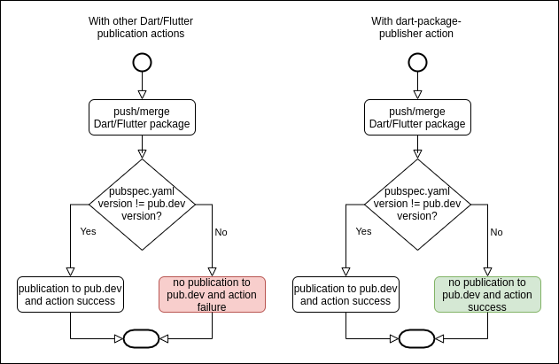

[![Build Status][ci-badge]][ci-badge-url]

## Description

Continuously Test & Publish Dart and Flutter Package To Pub.dev When Version Changed

## Prerequisite

You have to be a [Verified Publisher][4] to be able to publish from GH action w/o `Pub needs your authorization to upload packages on your behalf` check in console.

## The Challenge

Usually, when you are trying to `pub lish` your Dart package (or `pub publish` your Flutter package) and your `pubspec.yaml` has *the same* version as already published, you'll have a non zero exit code from `pub` tool and 
your workflow is **red**. 
So you cannot directly hook publish command as an re-action to `on: push` event. 

To keep a workflow **green** on each push, you have to prevent publishing step if versions are the same, 
and to compare versions, you should have both of them, remote and local.

This Action is intended to solve this challenge by continuously Test & Publish Dart/Flutter packages only **IF** local `pubspec.yml` has **different** version than already published on [Pub.dev](http://pub.dev) site.

It's handy to hook it up on `push, pull_request` [events][3].
```yaml
on: [push, pull_request]
```
and forget about it. When you need to publish a package, just bump the version in `pubspec.yaml`.



## Inputs

### `accessToken`

**Required** Google Account token from `~/.config/dart/pub-credentials.json` 
Put it as `secrets.OAUTH_ACCESS_TOKEN` on your repo [secrets section][1]

You can find the credentials.json within `.pub-cache` in the User's home directory.
You can use `open ~/.pub-cache`.

### `refreshToken`

**Required** Google Account token from `~/.config/dart/pub-credentials.json` 
Put it as `secrets.OAUTH_REFRESH_TOKEN` on your repo [secrets section][1]

You can find the credentials.json within `.pub-cache` in the User's home directory.
You can use `open ~/.pub-cache`.

### `credentialJson`

Replaces `accessToken` and `refreshToken` and contains the whole content of the `~/.config/dart/pub-credentials.json` file
Put it as `secrets.CREDENTIAL_JSON` on your repo [secrets section][1]

You can find the `pub-credentials.json` within `.config/dart` in the User's home directory.
You can use `open ~/.config/dart` after your first publication either through `pub lish` command for Dart or `pub publish` for Flutter.

### `relativePath`

**Optional** Path to your package root in your repository. In case you have a mono-repo, like this [one][2]

### `dryRunOnly`

**Optional** Perform dry run only, no real publishing. Default: `false`

### `skipTests`

**Optional** Skip unit tests run. Default: `false`

### `suppressBuildRunner`

**Optional** Suppress using `build_runner` for unit tests run. Default: `false`

### `format`

**Optional** Format code of project to get better score in pub.dev. Default: `false`

### `force`

**Optional** Force publishing even if pub tool throws warnings, hints, etc. Default: `false`

### `flutter`

**Optional** Flutter package type. Default: `false`, when omitted auto detected


## Outputs

### `success`

Result, "true" if actual publishing happened, "false" otherwise

### `package`

Package name from pubspec

### `localVersion`

Package local version from pubspec

### `remoteVersion`

Package remote version from pub.dev

### `dartVersion`

Dart SDK version which is being used to run tests & publish

### `flutterVersion`

Flutter SDK version which is being used to run tests & publish


## Dart or Flutter package example usage

```yaml
name: Publish to Pub.dev

on: push

jobs:
  publishing:
    runs-on: ubuntu-latest
    steps:
      - name: 'Checkout'
        uses: actions/checkout@v2 # required!
        
      - name: '>> Dart package <<'
        uses: k-paxian/dart-package-publisher@master
        with:
          accessToken: ${{ secrets.OAUTH_ACCESS_TOKEN }}
          refreshToken: ${{ secrets.OAUTH_REFRESH_TOKEN }}
```

[ci-badge]: https://github.com/k-paxian/dart-package-publisher/workflows/Workflow%20test/badge.svg
[ci-badge-url]: https://github.com/k-paxian/dart-package-publisher/actions
[1]: https://help.github.com/en/actions/automating-your-workflow-with-github-actions/creating-and-using-encrypted-secrets
[2]: https://github.com/k-paxian/dart-json-mapper
[3]: https://help.github.com/en/actions/automating-your-workflow-with-github-actions/workflow-syntax-for-github-actions#example-using-a-list-of-events
[4]: https://dart.dev/tools/pub/verified-publishers
